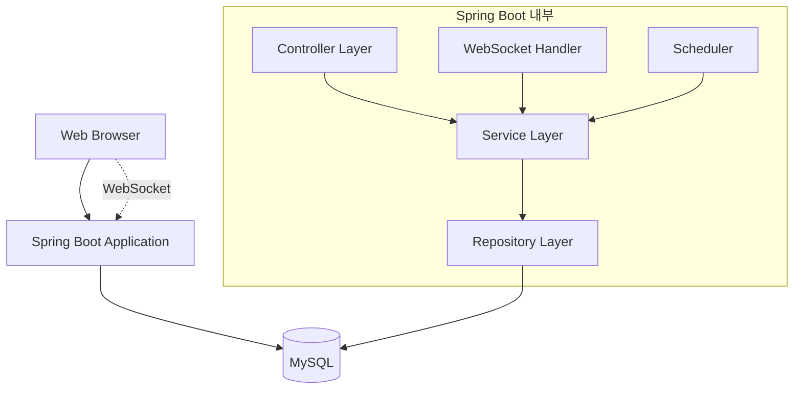
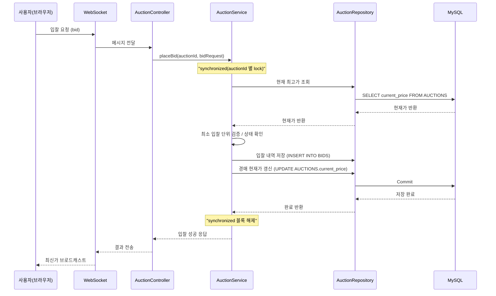

# 🏗 아키텍처

## 전체 구조

## 레이어 구조

- **Controller Layer**
    - HTTP 요청 처리, 세션 관리, DTO 변환
- **Service Layer**
    - 비즈니스 로직, 동시성 제어, 캐싱 처리
- **Repository Layer**
    - JPA 기반 DB 접근
- **WebSocket Handler**
    - 실시간 이벤트 브로드캐스트
    - 입찰 현황 실시간 전송
- **Scheduler**
    - 경매 종료 시점 제어, 낙찰 처리
    - @Scheduled 기반 자동화

---

## 사용 기술
- 인증: Spring Security 직접 구현
- 캐싱: **ConcurrentHashMap** → 단일 서버 환경
- 동시성 제어: `synchronized` 기반 → 기본 수준, 이후 DB Lock/Redis/MQ 고려
- 실시간: **WebSocket 단순 브로드캐스트**

---

## MVP 범위

1. **회원 관리**
    - 회원가입 / 로그인 / 로그아웃
    - 세션 기반 인증/인가
2. **경매 기능**
    - 등록 / 조회 / 입찰
    - 최고가 캐싱
3. **실시간 기능**
    - WebSocket을 통한 입찰 현황 반영
4. **자동화**
    - 스케줄러로 경매 종료 → 낙찰자 결정
    - PG API로 결제 시뮬레이션

---

## 시퀀스 다이어그램

