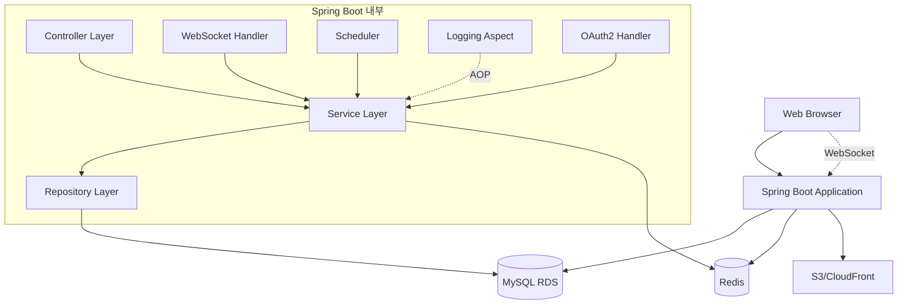
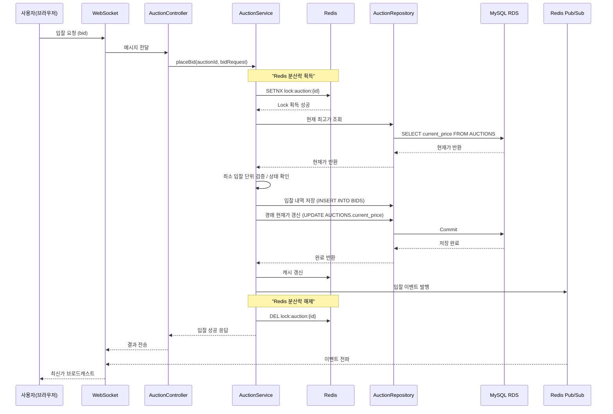

# 🏗 아키텍처

## 전체 구조

## DB ERD

## 레이어 구조

- **Controller Layer**
    - HTTP 요청 처리, 세션 관리, DTO 변환
    - OAuth2 인증 처리 (Google, Kakao)
- **Service Layer**
    - 비즈니스 로직, 동시성 제어, 캐싱 처리
    - Redis 분산락 기반 동시성 제어
- **Repository Layer**
    - JPA 기반 DB 접근
    - Optimistic Lock 적용
- **WebSocket Handler**
    - 실시간 이벤트 브로드캐스트
    - Redis Pub/Sub 기반 메시지 전파
    - 입찰 현황 실시간 전송
- **Scheduler**
    - 경매 종료 시점 제어, 낙찰 처리
    - @Scheduled 기반 자동화
- **Logging Aspect**
    - AOP 기반 로깅 처리
    - 주요 비즈니스 로직 실행 추적

---

## 사용 기술
- **인증/인가**:
    - Spring Security + 세션 기반 인증
    - OAuth2 소셜 로그인 (Google, Kakao)
- **캐싱**:
    - ~~ConcurrentHashMap~~ → **Redis Spring Cache**
    - TransactionAwareCacheManagerProxy 적용
- **동시성 제어**:
    - Redis 분산락 (Distributed Lock)
    - JPA Optimistic Lock (@Version)
- **실시간**:
    - WebSocket + Redis Pub/Sub 기반 브로드캐스트
- **인프라**:
    - AWS RDS (MySQL, Seoul Region)
    - AWS EC2 Redis
    - AWS S3 + CloudFront (이미지 저장/전송)
- **로깅**:
    - Spring AOP 기반 Logging Aspect

---

## MVP 범위

1. **회원 관리**
    - 회원가입 / 로그인 / 로그아웃
    - 세션 기반 인증/인가
    - OAuth2 소셜 로그인 (Google, Kakao)
    - 마이페이지 (경매 목록, 입찰 내역)
2. **경매 기능**
    - 경매 등록 / 조회 / 수정 / 삭제 (CRUD)
    - 입찰 / 즉시구매
    - 재경매 (동일 Product로 새로운 Auction 생성)
    - Redis 기반 최고가 캐싱
3. **실시간 기능**
    - WebSocket + Redis Pub/Sub 기반 입찰 현황 반영
    - 실시간 경매 정보 업데이트
4. **자동화**
    - 스케줄러로 경매 종료 → 낙찰자 결정
    - 경매 상태 자동 관리

---

## 시퀀스 다이어그램 (입찰 프로세스)

