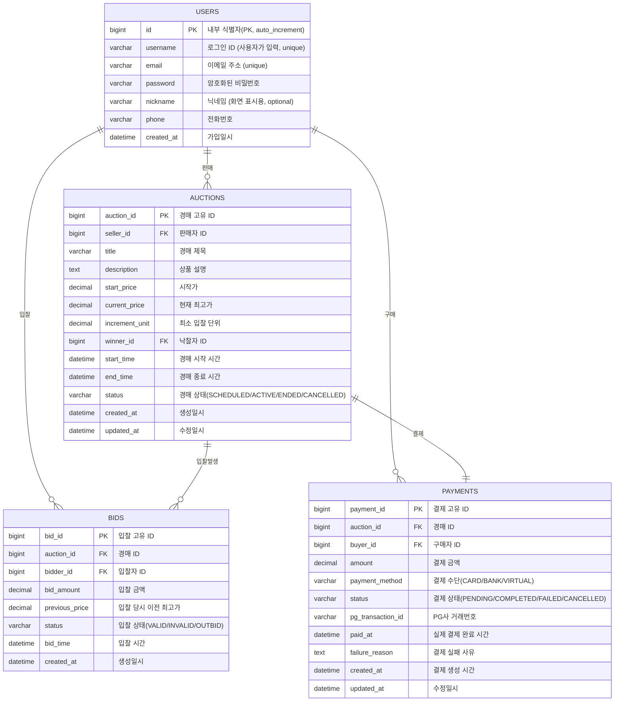

**도메인에서 필요한 엔티티**

- USERS → 사용자
- AUCTIONS → 경매
- BIDS → 입찰
- PAYMENTS → 결제

```mermaid
erDiagram
    USERS {
        bigint id PK "내부 식별자(PK, auto_increment)"       
        varchar username "로그인 ID (사용자가 입력, unique)"  
        varchar email "이메일 주소 (unique)" 
        varchar password "암호화된 비밀번호"
        varchar nickname "닉네임 (화면 표시용, optional)"
        varchar phone "전화번호"
        datetime created_at "가입일시"
    }
    AUCTIONS {
        bigint auction_id PK "경매 고유 ID"
        bigint seller_id FK "판매자 ID"
        varchar title "경매 제목"
        text description "상품 설명"
        decimal start_price "시작가"
        decimal current_price "현재 최고가"
        decimal increment_unit "최소 입찰 단위"
        bigint winner_id FK "낙찰자 ID"
        datetime start_time "경매 시작 시간"
        datetime end_time "경매 종료 시간"
        varchar status "경매 상태(SCHEDULED/ACTIVE/ENDED/CANCELLED)"
        datetime created_at "생성일시"
        datetime updated_at "수정일시"
    }
    BIDS {
        bigint bid_id PK "입찰 고유 ID"
        bigint auction_id FK "경매 ID"
        bigint bidder_id FK "입찰자 ID"
        decimal bid_amount "입찰 금액"
        decimal previous_price "입찰 당시 이전 최고가"
        varchar status "입찰 상태(VALID/INVALID/OUTBID)"
        datetime bid_time "입찰 시간"
        datetime created_at "생성일시"
    }
    PAYMENTS {
        bigint payment_id PK "결제 고유 ID"
        bigint auction_id FK "경매 ID"
        bigint buyer_id FK "구매자 ID"
        decimal amount "결제 금액"
        varchar payment_method "결제 수단(CARD/BANK/VIRTUAL)"
        varchar status "결제 상태(PENDING/COMPLETED/FAILED/CANCELLED)"
        varchar pg_transaction_id "PG사 거래번호"
        datetime paid_at "실제 결제 완료 시간"
        text failure_reason "결제 실패 사유"
        datetime created_at "결제 생성 시간"
        datetime updated_at "수정일시"
    }
    
    USERS ||--o{ AUCTIONS : "판매"
    USERS ||--o{ BIDS : "입찰"  
    USERS ||--o{ PAYMENTS : "구매"
    AUCTIONS ||--o{ BIDS : "입찰발생"
    AUCTIONS ||--|| PAYMENTS : "결제"
```